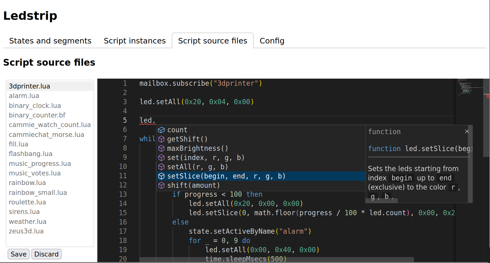

# ledstrip_sandbox: a multi-program programmable LED strip

Blogpost for the first version: https://zeus.ugent.be/blog/21-22/ledstrip_sandbox/.



## Build for the raspberry pi 2

With a recent podman or docker version installed, run:

```sh
./build.sh
```

## Deploy

With rsync installed and connected to the kelder network, run:

```sh
./deploy.sh
```
